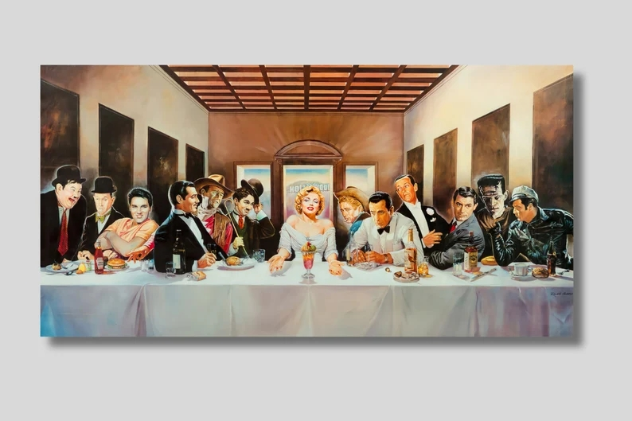

  

# Módulo 6 - Desafío 1
# Grupo: Fernando Lopes, José Eyzaguirre y Carlos Santana

Ruby on Rails - postgresql

## Descripción

Esta aplicación realiza el proceso de arriendo de video (o de cualquier artículo).  
Se simula el sistema de registros de arriendos, tomando en cuenta el hipotético caso de que una película puede ser arrendada por más de un cliente y el cliente solo puede arrendar una película a la vez.
Nota: Es importante destacar que este es un caso hipotético, en un caso real podría darse una relación de muchos a muchos entre las entidades de Película y Cliente.

## Inicio

Estas instrucciones te ayudarán a obtener una copia del proyecto y a ejecutarlo en tu máquina local para fines de desarrollo y prueba.

### Pre-requisitos

Este proyecto fue desarrollado con Rails - versión 7 y PostgreSQL - versión 16.

### Instalación

Sigue estos pasos para ejecutar el proyecto localmente:

1. Clona este repositorio en tu máquina local.  
git clone https://github.com/crsantanag/m5d5.git

2. Navega hasta el directorio del proyecto.  
cd m6d1

3. Instala las dependencias y modifica archivo database.yml  
   Las gemas que se deben instalar son:  
   - faker (crea datos ficticios)
   - httparty (conexión con la API OMDB para obtener la carátula de las películas)
   - pagy  (paginación)
   - pg_search (busqueda de string en los campos definidos)

4. Crea la base de datos, realiza la migración y carga los datos de prueba (ejecutar archivo seed.rb)  
    - rails db:create  
    - rails db:migrate  
    - rails db:seed

## Ejecutando las pruebas
Levanta el servidor y prueba la aplición.  
root está en /  
Este proyecto no cuenta con pruebas automatizadas. Sin embargo, puedes probar manualmente todas las funcionalidades.

## Licencia

Este proyecto está bajo la Licencia MIT. Consulta el archivo [LICENSE.md](LICENSE.md) para obtener más detalles.

⌨ ️Fernando Lopes, José Eyzaguirre y Carlos Santana (https://github.com/crsantanag)

